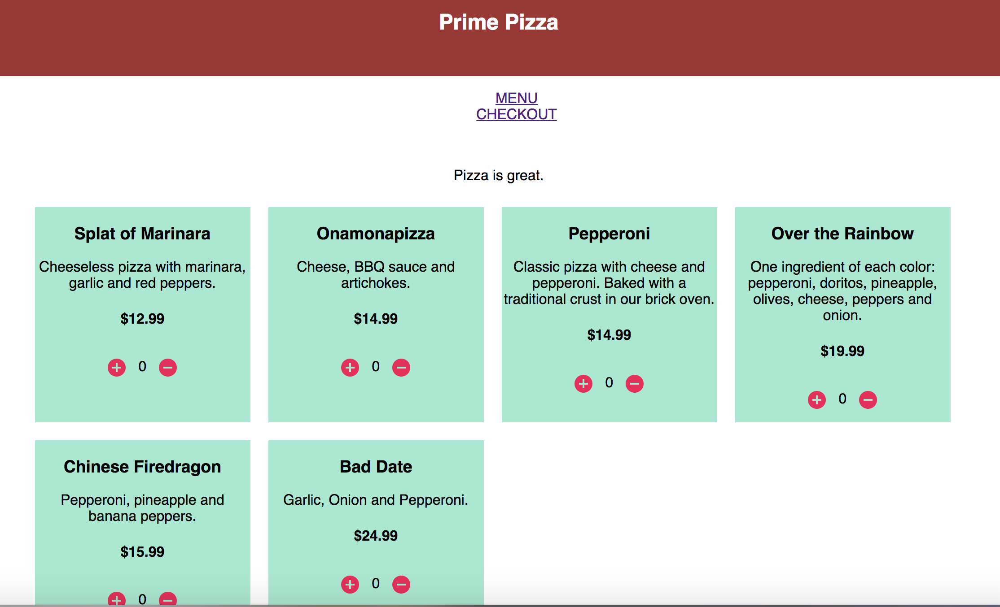
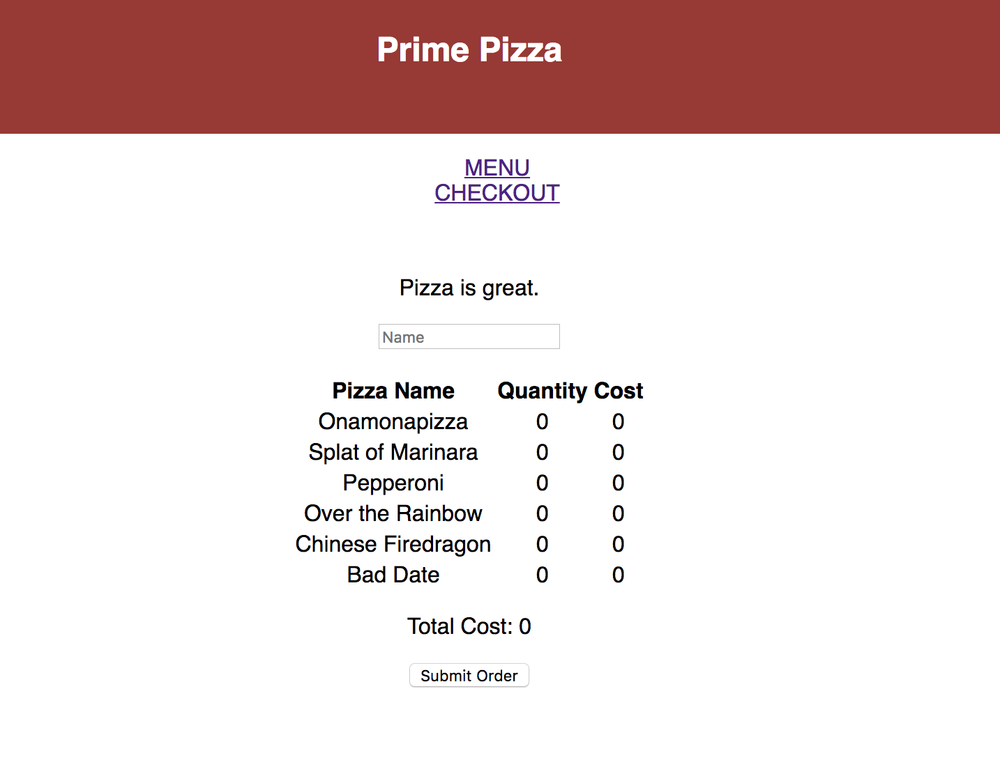

# React Pizza Parlor

Before you get started make sure to read through **ALL** requirements and outline a plan for your group. Assign out tasks and use branches to allow team members to work in parallel.

> HINT: Start with your `/api/pizza` GET route to give client side developers something to work with.

### Setup

Create your database and tables using the provided `data.sql` file. Start the server.

```
npm install
npm run server
```

Now that the server is running, open a new terminal tab with `cmd + t` and start the react client app.

```
npm run client
```

## BASE REQUIREMENTS

Your client has asked your team to build a pizza ordering system. They have provided a list of pizzas they currently offer in SQL format (`data.sql`). Your team should build out the following views.

### MENU

Display all of the pizzas on the screen. Allow users to increase or decrease the quantity of each pizza they would like to order. Show the total cost of items in the cart in the top right of this page.



### CHECKOUT

Include an input field for the users name and display a table of pizzas they have added to the cart. Users should not be able to modify item totals on this screen. When they click checkout, the users *name* and *order total* should be sent to the server and saved in the database.

> NOTE: **As a stretch goal**, add a junction table and save each pizza that has been added to the order. 



### ORDERS

This page **should not** appear in the navigation bar. Eventually the client would like to add authentication but for now, it will be available to anyone with the url [http://localhost:3000/orders](http://localhost:3000/orders). This page will display the name, time and order total for each of the orders placed.

> NOTE: **Base mode** does not require a JOIN. Just show all records from the orders table.


## STRETCH GOALS

- Create a new route that allows admins to add pizzas [http://localhost:3000/admin](http://localhost:3000/admin).
- Improve the stying of the app using Material-UI cards, buttons, nav bar and icons.
- Create a junction table and keep track of which pizzas are added to each order.
- Display a list of pizzas for each order on the orders page. 
- Add a button on the orders page to track delivery status.
- Give each pizza an image url and add pictures to the `public/images` folder.

# Name of Project

Pizza Parlor Group Project

## Built With

axios, material-ui, pg, react, redux

## Getting Started

```sql
CREATE DATABASE "pizza_parlor";

CREATE TABLE "pizza" (
  "id" serial primary key,
  "name" varchar(120),
  "description" varchar(480),
  "cost" numeric
);

CREATE TABLE "order" (
  "id" serial primary key,
  "customer_name" varchar(120),
  "order_total" numeric
);
```

```
npm install
npm run server
```

Now that the server is running, open a new terminal tab with `cmd + t` and start the react client app.

```
npm run client
```

### Prerequisites

Link to software that is required to install the app (e.g. node).

- [Node.js](https://nodejs.org/en/)
- [postgresql](https://www.postgresql.org/download/)


### Installing

Steps to get the development environment running.


## Screen Shot

<!-- will be added later  -->

## Documentation

- [Node.js](https://nodejs.org/en/)
- [React.js](https://reactjs.org/)
- [postgresql](https://www.postgresql.org/docs/)
- [material-ui-next](https://material-ui-next.com/)


### Completed Features

High level list of items completed.

- [x] Get route to database
- [x] Post route to database
- [x] sagas implemented
- [x] logger implemented
- [x] reudx implemented
- [x] database data appearing on DOM
- [ ] Post to database from client

### Next Steps

Features that you would like to add at some point in the future.

- [ ] Be able to create users and place orders by user.
- [ ] Save past orders per user.

## Deployment

Add additional notes about how to deploy this on a live system

## Authors

* Sarah Bloom
* Ian Carthey
* Teagan Nouska


## Acknowledgments

* Thanks to PrimeAcademy for the base project